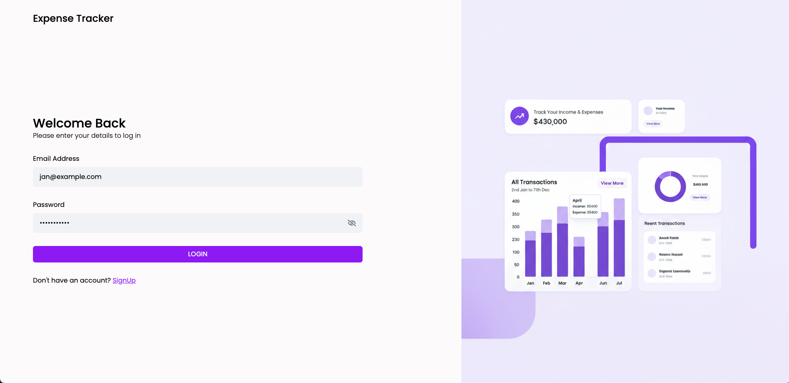
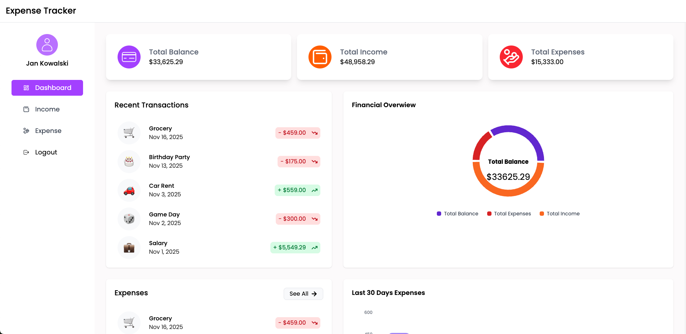
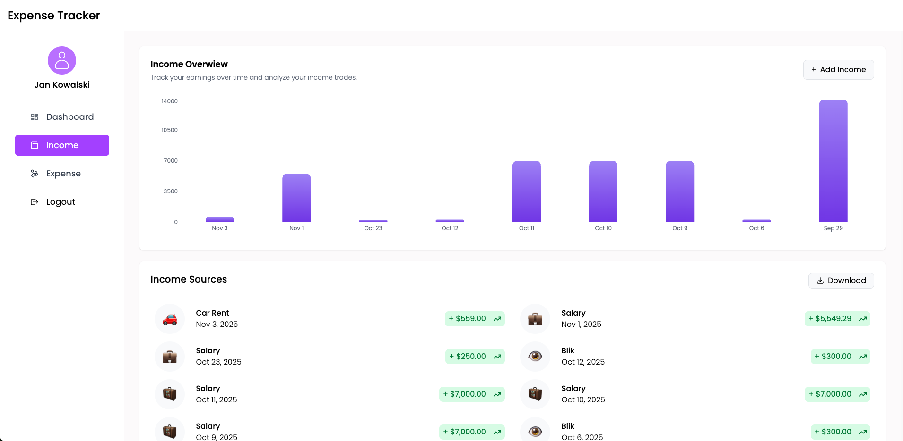
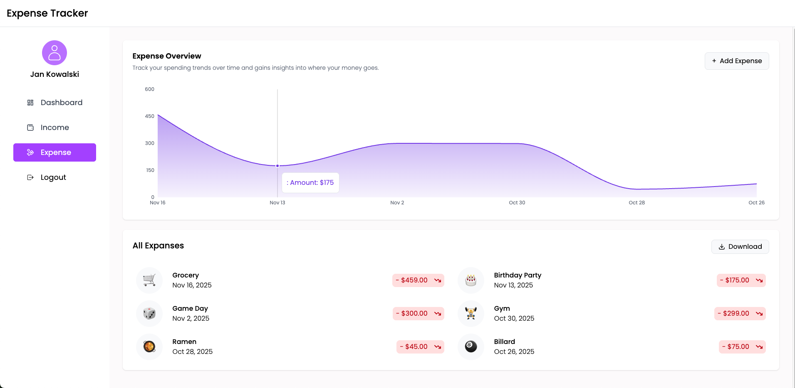

# Expense Tracker App

A web application for managing personal finances. It allows users to add, review, and analyze both income and expenses. With clear charts and summaries, users can track financial habits and make better budgeting decisions.

---

## ✨ Features

1. User Authentication – Secure login and sign-up using JWT authentication.
2. Dashboard Overview – Displays Total Balance, Income, and Expenses in summary cards.
3. Income Management – Add, view, delete, and export income sources.
4. Expense Management – Add, view, delete, and export expenses with category-based tracking.
5. Interactive Charts – Visual representation of income & expenses using Bar, Pie, and Line charts.
6. Recent Transactions – Displays the latest income and expense records for quick access.
7. Expense & Income Reports – Download all income and expense data in Excel format.
8. Mobile Responsive UI – Works seamlessly across desktops, tablets, and mobile devices.
9. Intuitive Navigation – Sidebar menu with easy access to Dashboard, Income, Expenses, and Logout.
10. Delete Functionality – Hover over income/expense cards to reveal a delete button for easy

---

## 🧰 Tech Stack

| Technology / Library  | Purpose                |
| --------------------- | ---------------------- |
| React                 | UI components          |
| React Router          | Navigation             |
| @tanstack/react-query | Server state & caching |
| Tailwind CSS          | Styling                |
| Axios                 | HTTP requests          |
| Recharts              | Data visualization     |
| React Hot Toast       | Notifications          |
| Moment.js             | Date formatting        |
| xlsx                  | Exporting to Excel     |

---

## Login Page



## Dashboard



## Income Page



## Expense Page



## Live Version 👉 https://mern-expense-tracker-app-sigma.vercel.app/login

## 📦 Installation

```bash
git clone https://github.com/your-repo-name.git
cd expense-tracker-app
npm install
npm run dev
```

🔒 Authentication

The app uses JWT Authentication.
After signing in, the token is stored in localStorage.
User data and state updates are handled using UserContext + React Query.
